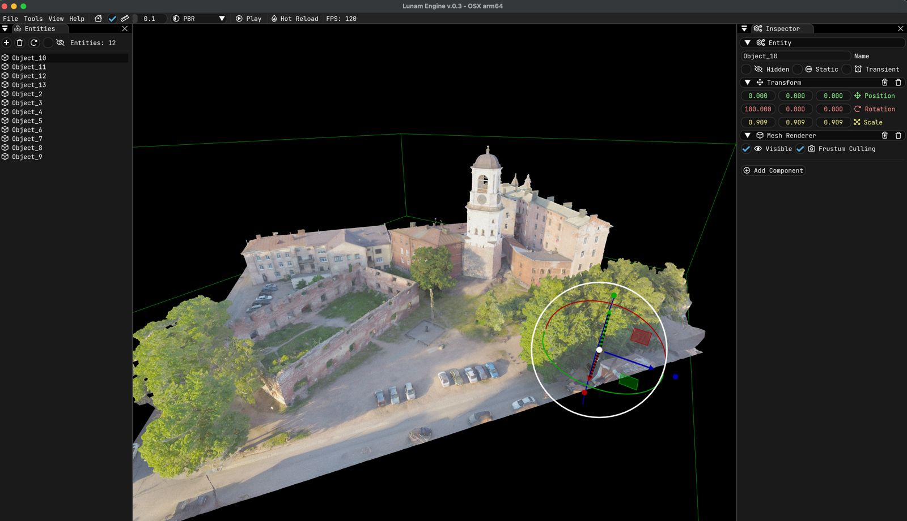

# Lunam Engine
Lunam is a simple but powerful realtime 3D game/simulation engine written in modern C++ 20 and Lua. 
It is designed to be easy to use and understand, but also to be powerful enough to create complex simulations and games. 
Lunam is also very lightweight and fast, and is designed to be cross-platform, with support for Windows, Linux, and OSX, while still supporting advanced graphics and a very powerful physics engine.

## Features
* Cross-platform support for Windows, Linux, and MacOS
* Multithreaded Vulkan rendering backend
  * PBR (Physically Based Rendering) materials
  * HDR (High Dynamic Range) rendering
  * Post-processing effects
  * Cascaded shadow mapping
  * Baked global illumination
  * Real-time reflections
  * Volumetric Clouds
  * Dynamic Sky
  * Day/Night cycle
* Fast ECS (Entity-Component-System) architecture
* Powerful multithreaded physics engine
* Easy to use Lua scripting API using LuaJIT
* Simple and powerful editor

