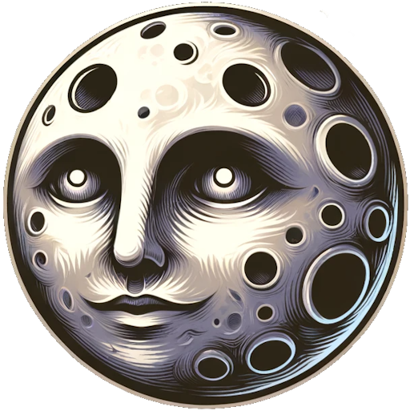

 

  

<h3 align="center">soliton engine</h3>

  

    Lightweight Vulkan game engine with Lua scripting and modern graphics
     
    <a href="https://github.com/MarioSieg/harmonic/docs/onboarding/1-Introduction"><strong>Explore the docs »</strong></a>
     
     
    <a href="https://github.com/MarioSieg/harmonic">View Demo</a>
    ·
    <a href="https://github.com/MarioSieg/harmonic/issues/new?labels=bug&template=bug-report---.md">Report Bug</a>
    ·
    <a href="https://github.com/MarioSieg/harmonic/issues/new?labels=enhancement&template=feature-request---.md">Request Feature</a>
  

  
Table of Contents

  <ol>
    <li>
      <a href="#about-the-project">About The Project</a>
    </li>
    <li>
      <a href="#getting-started">Getting Started</a>
      <ul>
        <li><a href="#prerequisites">Prerequisites</a></li>
        <li><a href="#installation">Installation</a></li>
      </ul>
    </li>
    <li><a href="#usage">Usage</a></li>
    <li><a href="#roadmap">Roadmap</a></li>
    <li><a href="#contributing">Contributing</a></li>
    <li><a href="#license">License</a></li>
    <li><a href="#contact">Contact</a></li>
    <li><a href="#acknowledgments">Acknowledgments</a></li>
  </ol>

## About The Project

![Product Name Screen Shot][product-screenshot]

## Roadmap

- [x] Cross-platform support for Windows, Linux, and MacOS
- [x] Parallel, high performance physics engine
- [x] Realtime audio engine  
- [x] Multithreaded Vulkan rendering backend
  - [x] PBR (Physically Based Rendering) materials
  - [x] Day/Night cycle
  - [x] Shader hot reloading
  - [ ] HDR (High Dynamic Range) rendering
  - [ ] Post-processing effects
  - [ ] Cascaded shadow mapping
  - [ ] Baked global illumination
  - [ ] Real-time reflections
  - [ ] Volumetric Clouds
  - [ ] Dynamic Sky
- [x] Fast ECS (Entity-Component-System) architecture
- [x] Easy to use Lua scripting API using LuaJIT
- [x] Simple but powerful scene editor

(<a href="#readme-top">back to top</a>)

<!-- LICENSE -->
## License

Distributed under the Apache 2 License. See `LICENSE.txt` for more information.

(<a href="#readme-top">back to top</a>)

<!-- CONTACT -->
## Contact

Mario Sieg - [@_mario_neo_](https://twitter.com/_mario_neo_) - mario.sieg.64@gmail.com

Project Link: [Soliton Engine](https://github.com/MarioSieg/soliton_engine)

Developed 2022-2024 in Berlin, Constance, Germany and Fecamp, France.

(<a href="#readme-top">back to top</a>)

[contributors-shield]: https://img.shields.io/github/contributors/MarioSieg/harmonic.svg?style=for-the-badge
[contributors-url]: https://github.com/MarioSieg/harmonic/graphs/contributors
[forks-shield]: https://img.shields.io/github/forks/MarioSieg/harmonic.svg?style=for-the-badge
[forks-url]: https://github.com/MarioSieg/harmonic/network/members
[stars-shield]: https://img.shields.io/github/stars/MarioSieg/harmonic.svg?style=for-the-badge
[stars-url]: https://github.com/MarioSieg/harmonic/stargazers
[issues-shield]: https://img.shields.io/github/issues/MarioSieg/harmonic.svg?style=for-the-badge
[issues-url]: https://github.com/MarioSieg/harmonic/issues
[license-shield]: https://img.shields.io/github/license/MarioSieg/harmonic.svg?style=for-the-badge
[license-url]: https://github.com/MarioSieg/harmonic/blob/master/LICENSE.txt
[linkedin-shield]: https://img.shields.io/badge/-LinkedIn-black.svg?style=for-the-badge&logo=linkedin&colorB=555
[linkedin-url]: https://linkedin.com/in/linkedin_username
[product-screenshot]: screenshots/1.png
