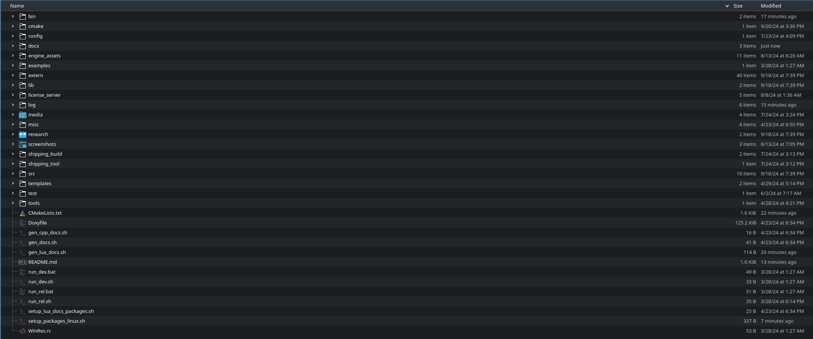
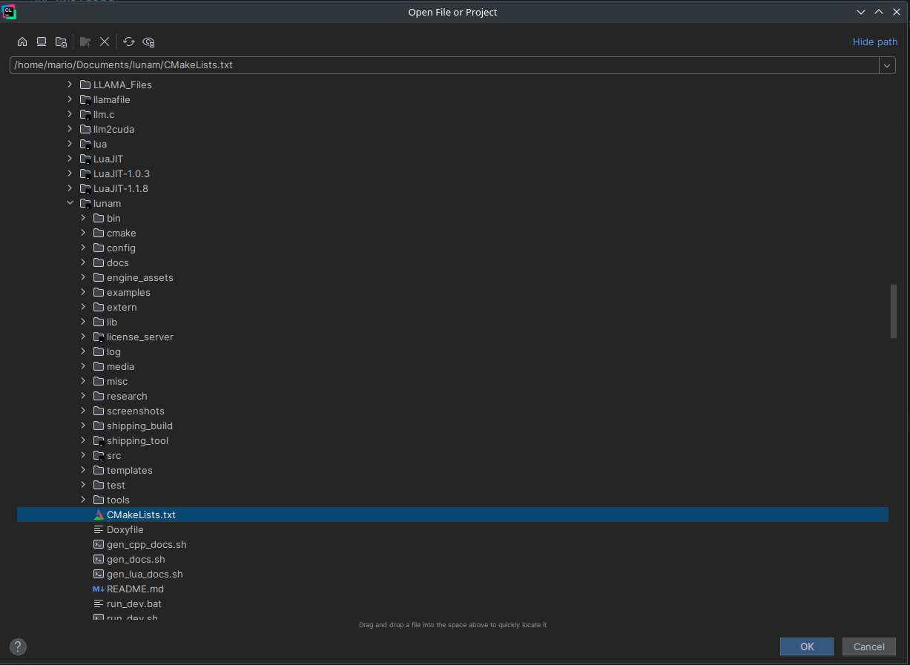
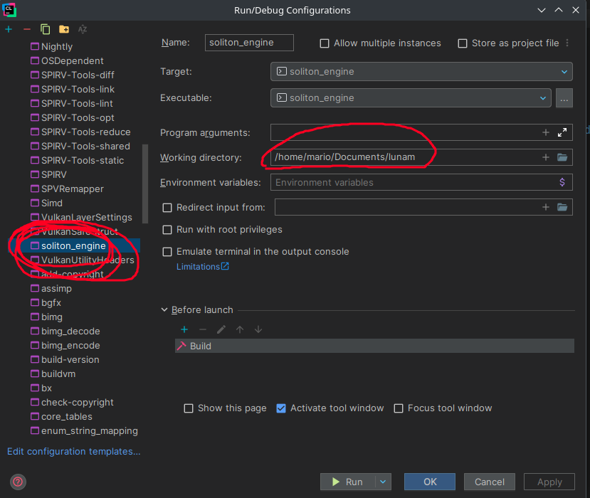
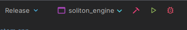

## Soliton Engine - Introduction

This guide will help you get started with Soliton Engine. It is a simple but powerful realtime 3D game/simulation engine written in modern C++ 20 and Lua.<br>
A game engine is a software framework designed for the creation and development of video games, simulations and other interactive software.<br>
Most game engine are very complex and hard to understand, but Soliton is designed to be easy to use and understand.<br>

## Clone the repository
Clone the repository from GitHub. Someone will need to provide you with access to the repository.
Recursive cloning is not necessary, as the submodules are included in the repository.

(Some directories such as bin, config, and log might not exist, but will be created during the build process.)

## Building
Soliton engine is built using CMake and requires a modern C++ compiler that supports C++20. The following compilers are supported:
* GCC 10 or later
* Clang 14 or later
* MSVC 2019 or later

Building and working in a large C++ codebase requires a lot of processing power and time, so it is recommended to have a powerful machine with at least 16GB-32GB of RAM, a fast SSD and a CPU with 8-16 cores or more.
While Linux is recommended for development, all platforms are supported for building and running the engine:
* Linux x86-64
* MacOS arm64 (Apple Silicon)
* Windows x86-64

### Linux
Follow these steps to build the engine on Linux, on a Debian-based distribution (Ubuntu, Mint, etc.):
Navigate to the root directory of the project and run the following commands:
1. Install the required system dependencies:
```bash 
bash setup_packages_linux.sh
```
2. Open CMakeLists.txt as a project in your IDE and build the project.
An IDE with CMake support is recommended, such as CLion, Visual Studio Code, or Qt Creator.
Remember to open CMakeLists.txt as a project not as a file, but in CLion File->Open->CMakeLists.txt does the trick.



3. Find the soliton_engine target in the run configurations and set the working directory to the root directory of the project.
The run configurations are usually located in the top right corner of the IDE, next to the green run button.
Scroll to the bottom of the list and click on Edit Configurations. In this window, search for soliton_engine and set the working directory to the root directory of the project.


4. From the run configurations, select soliton_engine as the target and run the project.


The engine will build and run, and you will see the output in the console.
Depening on the system, the build process might take a while, so be patient.
If build fails, check the error messages and try to fix them. If you can't fix them, ask Mario for help.
Most build errors arise from missing system dependencies, so make sure you have installed them or untested compiler versions.

## Project Structure
A short overview of the project structure:
* bin/ or cmake-build-xxxxxx - Build output directory
* cmake/ - CMake source files and scripts
* config/ - Configuration files for the engine
* docs/ - Documentation
* engine_assets/ - Engine assets such as shaders, textures, and models
* examples/ - Example projects and scenes
* extern/ - External libraries and submodules
* lib/ - Precompiled libraries for different platforms
* license_server/ - License server source code and scripts, used for managing licenses of the engine
* log/ - Log files generated by the engine at runtime
* media/ - Project media and logos
* misc/ - Miscellaneous scripts and files
* research/ - Research papers and articles
* screenshots/ - Screenshots of the engine
* shipping_build/ - Build output directory for shipping builds
* shipping_tool/ - Shipping tool source code and scripts, used for creating shipping builds
* src/ - Engine C++ source code
* templates/ - Different templates for creating new projects and scenes
* tests/ - Unit tests and integration tests
* tools/ - Tools and utilities for the engine

## Code
Talk is cheap, show me the code! ~ Linus Torvalds

Most engines have two code bases: the engine code and the game code.
The engine code is the code that runs the engine itself, doing things like rendering, physics, and audio.
This code is written in C++ as it needs to be fast and efficient.
The game code is the code that runs the game logic, such as player movement, AI, and game rules.
This code is written in Lua, a scripting language that is easy to use and understand.
In Soliton, the engine code is in the src/ directory, and the Lua game code is in the engine_assets/scripts.
Note that Soliton provides a powerful Lua API that allows you to interact with the engine in many ways,
but your own game logic will be stored in your Soliton project directory, not in the engine itself.

## Lua
Lua is a powerful, efficient, lightweight, embeddable scripting language.
I often compare Lua to a mixture of Python and JavaScript.
It is easy to learn and use, but powerful enough to create complex games and simulations.
Lua is used in many game engines, such as CryEngine, Lumberyard, and Roblox.
Soliton uses LuaJIT, a Just-In-Time compiler for Lua, which makes Lua code run very fast.
